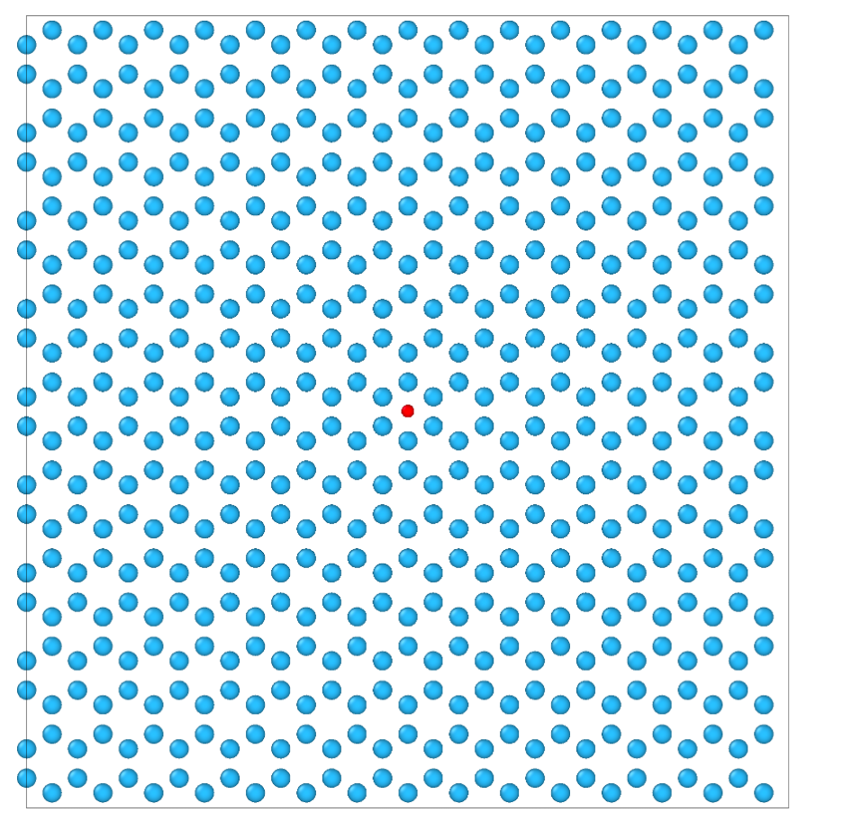

# Preliminaries
On Monday, we set up a variety of things needed to perform this portion of the project. Namely, we need to work with python in order to read in the initial structure, modify it (orthogonalize the structure, i.e. create a system where the unit cell has all 90 degree angles, and to make a supercell, i.e,, repeat the periodic structure to make a larger system with more atoms), and then finally  convert it to a LAMMPS data file that we can read in with the `read_data` command. We will also need python to analyze the output of these simulations.

So what did we do?
**1.** Fist, we got an account on the [Materials Project](https://next-gen.materialsproject.org/), and found the correct [ground state Hf structure]([https://next-gen.materialsproject.org/materials/mp-103]) (i.e., by searching for Hf, and looking at which structure had 0.0 eV/atom "energy above hull"
**2.** Installed [miniconda](https://docs.anaconda.com/miniconda/) for windows, so that you can create a dedicated virtual environment to use the specific python packages we care about and to isolate their dependencies so that in the future, if you want to use other packages, the dependencies don't conflict.
**3.** Using the anaconda powershell application (rather than regular powershell), we can see that the prompt now starts with `(base)` which means you are in the base python environment that conda has set up for you. Then we created a new conda environment with python 3.12 and preloaded with important packages like numpy, matplotlib, and Jupyter notebook.
```zsh
conda create -n mit python=3.12 numpy matplotlib notebook
...
conda activate mit
```
Always remember to activate the appropriate environment you want to use!

**4.** In our MIT conda environment, we added another package using pip
```
pip install mp-api
```
**5.** Finally, we opened up VSCode in your workspace folder using `code .`, Installed the Python and Jupyter extensions in VS Code, then created a file `test.ipynb`, making sure to select the kernel associated with the newly created `mit` conda environment. We can now write and run Jupyter notebooks in VSCode with blocks of python code.

# Obtain initial Hf structure and orthogonalize it
First, we want to create a Hf structure that represents a pristine Hf crystal in it's experimentally observed groundstate phase. As our starting point, we're going to use the structure files available at the [Materials Project](https://next-gen.materialsproject.org/). After searching for Hf, we find this [ground state structure](https://next-gen.materialsproject.org/materials/mp-103). This structure is hexagonal closed-pack (HCP), and a quick sanity check of [wikipedia](https://en.wikipedia.org/wiki/Hafnium) shows that the experimental Hf structure is also HCP. Once we obtain this structure, we will want to orthogonalize this structure. Basically, if you look a the structure in the materials project viewer, you can see a diamond shape for the unit cell box. We want to modify this structure so that the angles between the cell vectors are 90 degress (you create a rectangular prism effectively), but preserve the periodic arrangeent of the atoms. This is not trivial to do, but fortunately others have developed methods to do this for us.

There are two ways of obtaining this structure in a way that we can then manipulate it:
- One is the approach discussed on Monday, where we use the Materials Project API and programmatically obtain the configuration. This can be seen in the 0_obtain_orthogonal_Hf_structure/create_orthog_Hf_with_pymatgen.ipynb file. Unfortunately, this approach relies on the [pymatgen](https://pymatgen.org/) ecosystem,which doesn't have great functionality to orthogonalize the structure (the function it does have produces an unnecessarily large structure).
- The alternative approach is to use the [atomic simulation environment](https://wiki.fysik.dtu.dk/ase/) (ASE) along with an additional package known as [abTEM](https://github.com/abTEM/abTEM). In order to use these packages, you need to run the following commands **in your new conda environment**
```
pip install git+https://gitlab.com/ase/ase.git@master
pip install abtem
```

Once you have these packages installed, download the Hf.cif file from the [materials project link](https://next-gen.materialsproject.org/materials/mp-103) (click on the bottom button in the structure visualizer). Then, you can recreate the commands in 0_obtain_orthogonal_Hf_structure/create_orthog_Hf_with_ase.ipynb. Basically this code reads in the .cif file, orthogonalizes it, then converts it to a LAMMPS data file.


# Minimizing Hf, then supercelling and adding an interstitial

In 1_relax_orthog_Hf_structure_with_comb, we take the LAMMPS Data file generated in the previous step and minimize it using the COMB potential. Note that we allow the entire cell to relax (i.e. both the atoms and the cell vectors). Also, the COMB potential also involves a charge equilibration step usually, but we do not need that for the pure bulk Hf structure.

Then in 2_make_supercell_and_interstitial, we once again use the ASE package, this time to create a supercell of the structure we just relaxed (i.e., we periodically repeat the system to create a larger system). We then output a temporary DATA file to visualize in OVITO. Using this file, we need to identify a location to manually add our O interstitial. Note that the location of this O interstitial does matter, because LAMMPS has a hard time minimizing atoms to find the "correct" interstitial location (basically the atom gets stuck in what is known as a local minima, which is not the true lowest energy position.) The location of the O interestitial should be placed in the middle of the atoms, and in particular needs to be located in the middle of the hexagonal motifs, like in the following image:


After we've identified the location, we manually append this atom to our structure in the notebook, and we then output the corresponding LAMMMPS data file, and move on to the next minimization step.

# Minimizing the Hf structure with the O interestitial.

The relevant files are located in 3_relax_supercell_with_oint/better_Oint_starting_location. The other folders consisted of a different startintg structure with the O interstitial starting in a different location. I could not get the LAMMPS minimizer to find the appropriate interestitail, hence why I made a new starting structure with a different O interstial position (see the discussion in the above section).

A few notes about this minimization. First, the lattice cell/box is fixed: we are only relaxing the atoms (this is the appropriate thing to do when you are trying to model a "dilute" defect). Second, now that we have an Oxygen in this material, it will "extract" some charge from the surrounding Hf atoms, so because we are using the COMB potential, we now have to include the charge equilibration step (i.e. `fix qeq/comb`). After LAMMPS figures out what charges should be assigned to each atom, we then run the minimzation command, using the steepest descent (sd) and backtrack approach (which is a bit more robust then the LAMMPS defaults).

As a final step, we use the convert_dump_to_data.py file to convert the LAMMPS dump file (the .lammpstrj file) to a DATA file that can be read in in the next step. You can run this by first modifying the input and output file names in the script, then running `python convert_dump_to_data.py`


# Running NVT with the structure

The following step is to run a trial fixed-temperature molecular dynamics to see what behavior we observe. The script for this is in 4_run_NVT. Please run this yourself and observe what happens in Ovito.